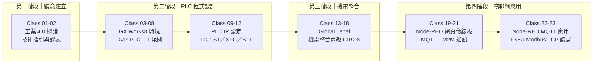
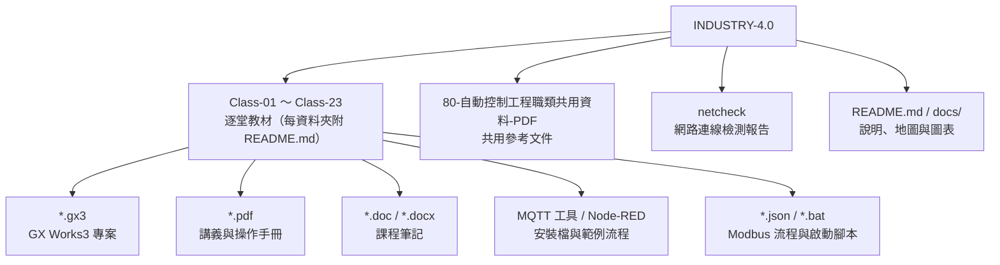
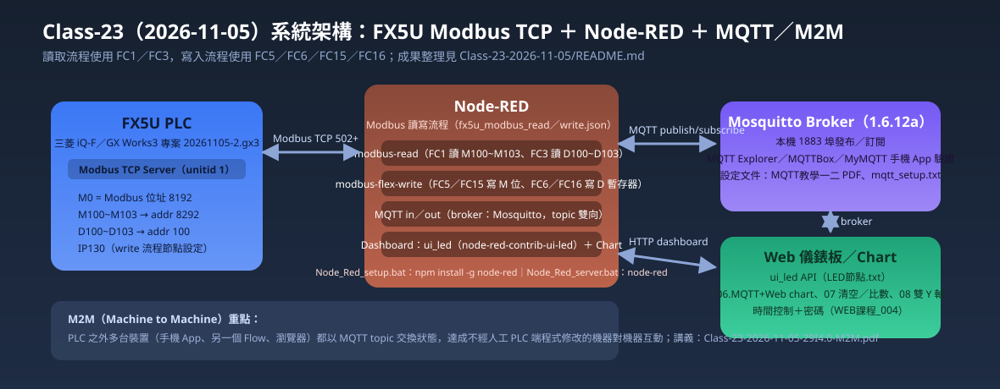
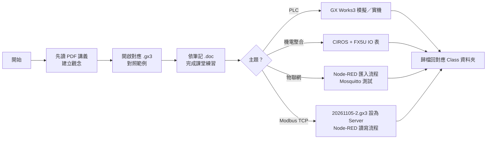
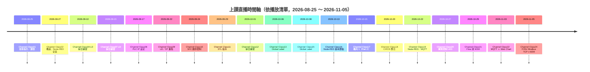
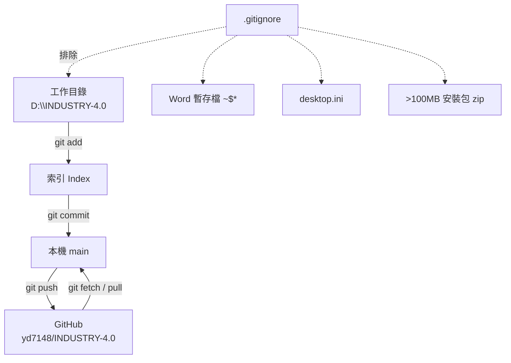

# 工業 4.0 自動控制工程職類｜課程教材庫

本倉庫收錄 **2026-08-25 ～ 2026-11-05** 期間「工業 4.0／自動控制工程職類」課程的教材、範例程式與課後補充資料，共 **23 堂課**、四大主題（PLC 程式設計、機電整合、Node-RED／MQTT 物聯網應用、FX5U Modbus TCP／M2M 通訊）與一份網路檢測報告。

| 項目 | 內容 |
|---|---|
| 線上倉庫 | <https://github.com/yd7148/INDUSTRY-4.0> |
| 預設分支 | `main` |
| 課程期間 | 2026-08-25 ～ 2026-11-05（23 堂） |
| 主要工具 | GX Works3、DVP-PLC、Node-RED、Mosquitto、MQTT Explorer、FX5U Modbus TCP |
| 上課影片播放清單 | [工業4.0--工業4.0概論（YouTube）](https://www.youtube.com/playlist?list=PLKvXv11lxGbo) |
| 文件語言 | 繁體中文 |

> 本文件只做「索引與導覽」。每堂課的完整檔案清單請見 [docs/COURSE-MAP.md](docs/COURSE-MAP.md)；
> 各 Class 資料夾各自附有 README.md（上課 YT 連結、筆記、參考文件與程式說明）；
> 版本控制與推送檢核紀錄請見 [docs/PUSH-RECORD.md](docs/PUSH-RECORD.md)。

---

## 1. 課程主題地圖


```mermaid
flowchart LR
    subgraph P1["第一階段｜觀念建立"]
        A1["Class 01-02<br/>工業 4.0 概論<br/>技術指引與課表"]
    end
    subgraph P2["第二階段｜PLC 程式設計"]
        B1["Class 03-08<br/>GX Works3 環境<br/>DVP-PLC101 範例"]
        B2["Class 09-12<br/>PLC IP 設定<br/>LD／ST／SFC／STL"]
    end
    subgraph P3["第三階段｜機電整合"]
        C1["Class 13-18<br/>Global Label<br/>機電整合丙級 CIROS"]
    end
    subgraph P4["第四階段｜物聯網應用"]
        D1["Class 19-21<br/>Node-RED 網頁儀錶板<br/>MQTT．M2M 通訊"]
        D2["Class 22-23<br/>Node-RED MQTT 應用<br/>FX5U Modbus TCP 讀寫"]
    end
    A1 --> B1 --> B2 --> C1 --> D1 --> D2
```


```mermaid
flowchart TB
    REPO["INDUSTRY-4.0"] --> CLS["Class-01 ～ Class-23<br/>逐堂教材（每資料夾附 README.md）"]
    REPO --> LIB["80-自動控制工程職類共用資料-PDF<br/>共用參考文件"]
    REPO --> NET["netcheck<br/>網路連線檢測報告"]
    REPO --> DOC["README.md / docs/<br/>說明、地圖與圖表"]

    CLS --> GX["*.gx3<br/>GX Works3 專案"]
    CLS --> PDF["*.pdf<br/>講義與操作手冊"]
    CLS --> DOCX["*.doc / *.docx<br/>課程筆記"]
    CLS --> TOOL["MQTT 工具 / Node-RED<br/>安裝檔與範例流程"]
    CLS --> JSON["*.json / *.bat<br/>Modbus 流程與啟動腳本"]
```

### 課程時間軸（SVG）


> SVG 原檔：[docs/img/course-timeline.svg](docs/img/course-timeline.svg)。Class-23 的 Modbus＋MQTT 系統架構圖：[docs/img/class23-modbus-mqtt.svg](docs/img/class23-modbus-mqtt.svg)。



---

## 2. 課程索引

| # | 日期 | 主題 | 代表教材 |
|:--:|---|---|---|
| 01 | 2026-08-25 | 工業 4.0 技術指引與課程說明 | `0825-teacher-I4.0-技術指引_V1.1.pdf`、`115-2 I4.0課表.pdf` |
| 02 | 2026-08-27 | 工業 4.0 概論、Node-RED 環境安裝 | `01-工業4.0概論_20260827.pdf`、`Node_Red_setup.zip` |
| 03 | 2026-09-01 | GX Works3 安裝與 PLC 基礎 | `GX-Works3 Operating Manual_cht.pdf`、`20260901-test1.gx3` |
| 04 | 2026-09-03 | DVP-PLC101 範例、階梯圖練習 | `DVP-PLC101samples_tc.pdf`、`EX101-LD-20260903.gx3` |
| 05 | 2026-09-04 | 基本指令與 LD 程式實作 | `Class-05-2026-09-04-notes.doc`、多個 `*.gx3` |
| 06 | 2026-09-08 | LD 程式延續與課堂練習 | `20260908-test3.gx3`、`Class-05-2026-09-04-notes.doc` |
| 07 | 2026-09-15 | LD 綜合練習 | `2026-09-10-1.gx3`、`Class-05-2026-09-10-notes.doc` |
| 08 | 2026-09-10 | LD 綜合練習（與 Class-07 教材重疊） | `2026-09-10-1.gx3` |
| 09 | 2026-09-17 | PLC IP 設定與專案範本 | `PLC-IP-SET.gx3`、`2026-09-15-IP145-template.gx3` |
| 10 | 2026-09-22 | 基本 LD／ST 與 ST 進階 | `0922-teacher-115-2 basic LD.gx3`、`0922-teacher-115-2 ST Advance.gx3` |
| 11 | 2026-09-24 | SFC 順序控制流程 | `01-Class-10-2026-09-24-PLC SFC.pdf`、`Class-09-2026-09-24-ST.gx3` |
| 12 | 2026-09-29 | STL 指令與 EX101 應用 | `0929-teacher-EX101 STL.gx3`、`2026-09-29.gx3` |
| 13 | 2026-10-01 | 綜合程式練習 | `2026-10-01-.gx3`、`2026-10-01-2.gx3` |
| 14 | 2026-10-06 | Global Label 與程式整理 | `2026-10-06-01.gx3`、`global label.jpg` |
| 15 | 2026-10-08 | Global Label 應用 | `2026-10-08-1.gx3` |
| 16 | 2026-10-13 | Node-RED 基本節點與儀錶板 | `Day2_20261013/Node-RED教材_基本節點.pdf` |
| 17 | 2026-10-15 | 機電整合丙級（機丙 1）與 IP 練習 | `機丙1 tutorial-2026-10-15.gx3` |
| 18 | 2026-10-20 | CIROS 機電整合丙 1 整合實作 | `IP133 20261020 CIROS_機電整合丙1_2.gx3` |
| 19 | 2026-10-22 | Node-RED 網頁應用、MQTT 工具 | `Node-RED 網頁應用/`、`MQTT 工具/` |
| 20 | 2026-10-27 | Node-RED 網頁控制 LED、定時與圖表 | `Node-RED 網頁應用_20261027/`、`Class-20-2026-10-27.doc` |
| 21 | 2026-10-29 | Node-RED Flow 設計與 M2M 應用 | `Node-RED _ Flow 2.html`、`Class-21-2026-10-29I4.0-M2M.pdf`、`2026-10-29-template-1.gx3` |
| 22 | 2026-11-03 | Node-RED MQTT 應用、Web Chart 進階 | `01-Node-RED MQTT應用_20261102.pdf`、`06.MQTT+Web chart-NEW.txt`、`Day5_20261103.zip` |
| 23 | 2026-11-05 | FX5U Modbus TCP 讀寫與 M2M 應用 | `Class-23-2026-11-05-29I4.0-M2M.pdf`、`fx5u_modbus_read.json`、`fx5u_modbus_write.json`、`20261105-2.gx3` |

> 主題依資料夾名稱與教材檔名歸納；Class-07 與 Class-08 的資料夾編號與日期曾因課程重新編號而錯位，
> 表中以實際資料夾為準。Class-07／08 內容高度重複，屬同一堂課的兩份快照。

---

## 3. 目錄結構

```text
INDUSTRY-4.0/
├─ Class-01-2026-08-25/          # 工業 4.0 概論、課表
├─ Class-02-2026-08-27/          # 概論、Node-RED 安裝包
├─ Class-03-2026-09-01/          # GX Works3、PLC 基礎
├─ ...
├─ Class-22-2026-11-03/          # Node-RED MQTT 應用、Web Chart 進階
├─ Class-23-2026-11-05/          # FX5U Modbus TCP 讀寫、M2M
│  ├─ Day5_20261103/             # 上課流程包原始檔（含 README）
│  ├─ MQTT 工具/                 # Mosquitto Broker 與 Client 工具（含 README）
│  └─ Node-RED 網頁應用_Day5_20261103/  # 06~08 流程副本（含 README）
├─ 80-自動控制工程職類共用資料-PDF/
│  ├─ Delta/                     # DVP-PLC、ISPSoft 手冊
│  ├─ FX5U/                      # FX5U、GX Works3、ST 指南
│  └─ CIROS/                     # 機電丙規範與 IO 表
├─ docs/
│  ├─ COURSE-MAP.md              # 逐堂教材清單與技能矩陣
│  ├─ PUSH-RECORD.md             # 推送流程與檢核紀錄
│  └─ img/
│     ├─ course-timeline.svg     # 23 堂課時間軸圖
│     └─ class23-modbus-mqtt.svg # Class-23 Modbus＋MQTT 架構圖
├─ netcheck/                     # 網路連線／Port／測速檢測
├─ README.md
└─ .gitignore
```

> 每個 `Class-XX-…` 資料夾（以及 Class-23 的三個子資料夾）都附有 **README.md**，
> 說明該堂課的 **上課 YouTube 直播連結（依播放清單日期對應）、課堂筆記、參考文件與程式檔案**。

---

## 4. 教材類型與建議閱讀順序

| 類型 | 副檔名 | 用途 | 建議工具 |
|---|---|---|---|
| PLC 專案 | `.gx3` | 課堂範例、練習與解答 | GX Works3 |
| 講義／手冊 | `.pdf` | 觀念說明與操作步驟 | 任意 PDF 閱讀器 |
| 課程筆記 | `.doc`、`.docx` | 教師授課重點 | Word 或 LibreOffice |
| Node-RED 流程 | `.txt`、`.json` | 匯入節點流程 | Node-RED 編輯器 |
| 工具安裝檔 | `.exe`、`.zip` | MQTT／Node-RED 環境 | 詳見各資料夾說明 |
| 檢測腳本 | `.ps1`、`.md` | 網路診斷與報告 | PowerShell |


```mermaid
flowchart LR
    S["開始"] --> A["先讀 PDF 講義<br/>建立觀念"]
    A --> B["開啟對應 .gx3<br/>對照範例"]
    B --> C["依筆記 .doc<br/>完成課堂練習"]
    C --> D{"主題？"}
    D -->|PLC| E["GX Works3 模擬／實機"]
    D -->|機電整合| F["CIROS + FX5U IO 表"]
    D -->|物聯網| G["Node-RED 匯入流程<br/>Mosquitto 測試"]
    D -->|Modbus TCP| H["20261105-2.gx3 設為 Server<br/>Node-RED 讀寫流程"]
    E --> I["歸檔回對應 Class 資料夾"]
    F --> I
    G --> I
    H --> I
```

---

## 5. 環境與工具

| 工具 | 用途 | 相關資料夾 |
|---|---|---|
| GX Works3 | 三菱 FX5U PLC 程式編輯與模擬 | `Class-03` 起、`80-.../FX5U` |
| ISPSoft | 台達 DVP-PLC 程式編輯 | `80-.../Delta` |
| Node-RED | 網頁化流程與儀錶板 | `Class-16`、`Class-19`～`Class-23` |
| Mosquitto | MQTT Broker | `Class-19/MQTT 工具`、`Class-20/MQTT 工具`、`Class-22~23/MQTT 工具` |
| MQTT Explorer／MQTTBox | MQTT 訊息測試 | 同上 |
| FX5U Modbus TCP | PLC 資料讀寫（FC1/3/5/6/15/16） | `Class-23` |
| CIROS | 機電整合虛擬機台 | `80-.../CIROS`、`Class-18` |

> 教材內的 `.exe`、`.zip` 為課堂教學用安裝檔，僅供教學參考；安裝前請自行確認來源與授權。

---

## 6. 上課影片播放清單

所有上課直播收錄於 YouTube 播放清單，頻道：**留五針**。

| 項目 | 內容 |
|---|---|
| 清單名稱 | **工業4.0--工業4.0概論**（I-4.0; Industrial-4.0） |
| 影片數 | **19 段直播**（涵蓋 2026-08-25 ～ 2026-11-05） |
| 觀看方式 | 下方「播放清單網址」一次看完，或逐段點擊下表影片連結 |
| 播放清單網址 | <https://www.youtube.com/playlist?list=PLKvXv11lxGbo> |


```mermaid
timeline
    title 上課直播時間軸（依播放清單，2026-08-25 ～ 2026-11-05）
    2026-08-25 : Channel Class01 技術指引／課表
    2026-08-27 : Channel Class02 概論、Node-RED 安裝
    2026-09-10 : Channel Class04 LD 綜合練習
    2026-09-15 : Channel Class07 LD 綜合練習
    2026-09-17 : Channel Class08 PLC IP 設定
    2026-09-22 : Channel Class09 LD／ST 進階
    2026-09-24 : Channel Class10 SFC 順序控制
    2026-09-29 : Channel Class11 STL 指令
    2026-10-01 : Channel Class12 綜合練習
    2026-10-06 : Channel Class13 Global Label
    2026-10-08 : Channel Class15 Global Label
    2026-10-13 : Channel Class16 Node-RED 基本節點
    2026-10-15 : Channel Class17 機丙 1（Part 2）
    2026-10-20 : Channel Class18 CIROS 整合
    2026-10-22 : Channel Class19 Node-RED／MQTT
    2026-10-27 : Channel Class20 網頁控制 LED
    2026-10-29 : Channel Class21 Flow 與 M2M
    2026-11-03 : Channel Class22 MQTT ＋ Web Chart
    2026-11-05 : Channel Class24 FX5U Modbus TCP＋M2M
```

> 註：直播存檔的「Channel 課次編號」與資料夾編號不完全一致（例如 2026-11-05 的影片標題為
> Class24-2026-11-05，但對應本庫的 Class-23）。下表一律**以上課日期**對應到資料夾。

| 上課日期 | 本庫資料夾 | 影片 | 長度 |
|---|---|---|--:|
| 2026-08-25 | Class-01 | [工業4.0-2026-08-25](https://www.youtube.com/watch?v=18ot0-nbHtM&list=PLKvXv11lxGbo) | 2:54:37 |
| 2026-08-27 | Class-02 | [工業4.0-2026-08-27](https://www.youtube.com/watch?v=cr5l5oebU7I&list=PLKvXv11lxGbo) | 2:52:40 |
| 2026-09-10 | Class-08 | [工業4.0-2026-09-10](https://www.youtube.com/watch?v=f29rsBUVOM8&list=PLKvXv11lxGbo) | 2:58:35 |
| 2026-09-15 | Class-07 | [工業4.0-2026-09-15](https://www.youtube.com/watch?v=IIvgYmmdBQQ&list=PLKvXv11lxGbo) | 3:09:33 |
| 2026-09-17 | Class-09 | [工業4.0-2026-09-17](https://www.youtube.com/watch?v=PnkD23eItPw&list=PLKvXv11lxGbo) | 2:50:59 |
| 2026-09-22 | Class-10 | [工業4.0-2026-09-22](https://www.youtube.com/watch?v=YvLJYoDYwQE&list=PLKvXv11lxGbo) | 2:57:39 |
| 2026-09-24 | Class-11 | [工業4.0-2026-09-24](https://www.youtube.com/watch?v=_6sBSa4dwEk&list=PLKvXv11lxGbo) | 2:54:57 |
| 2026-09-29 | Class-12 | [工業4.0-2026-09-29](https://www.youtube.com/watch?v=hyQsr6LRrXU&list=PLKvXv11lxGbo) | 3:03:37 |
| 2026-10-01 | Class-13 | [工業4.0-2026-10-01](https://www.youtube.com/watch?v=plvnBD65rQs&list=PLKvXv11lxGbo) | 3:04:49 |
| 2026-10-06 | Class-14 | [工業4.0-2026-10-06](https://www.youtube.com/watch?v=BW0T8RQLV0s&list=PLKvXv11lxGbo) | 3:01:39 |
| 2026-10-08 | Class-15 | [工業4.0-2026-10-08](https://www.youtube.com/watch?v=VAJEc1f5dSs&list=PLKvXv11lxGbo) | 3:05:13 |
| 2026-10-13 | Class-16 | [工業4.0-2026-10-13](https://www.youtube.com/watch?v=GGhErkxavAs&list=PLKvXv11lxGbo) | 2:42:48 |
| 2026-10-15 | Class-17 | [工業4.0-2026-10-15 Class17-Part-2](https://www.youtube.com/watch?v=r7HuMHnCCu4&list=PLKvXv11lxGbo) | 1:56:42 |
| 2026-10-20 | Class-18 | [工業4.0-2026-10-20](https://www.youtube.com/watch?v=7Skj8dwFkRY&list=PLKvXv11lxGbo) | 2:53:03 |
| 2026-10-22 | Class-19 | [工業4.0-2026-10-22](https://www.youtube.com/watch?v=0YhJ1nQwPH4&list=PLKvXv11lxGbo) | 2:57:21 |
| 2026-10-27 | Class-20 | [工業4.0-2026-10-27](https://www.youtube.com/watch?v=QoYQ7r5mEaU&list=PLKvXv11lxGbo) | 2:49:31 |
| 2026-10-29 | Class-21 | [工業4.0-2026-10-29](https://www.youtube.com/watch?v=_vi7SMZXi6A&list=PLKvXv11lxGbo) | 2:51:04 |
| 2026-11-03 | Class-22 | [工業4.0-2026-11-03](https://www.youtube.com/watch?v=IDaHEhsdeMQ&list=PLKvXv11lxGbo) | 2:30:03 |
| 2026-11-05 | Class-23 | [工業4.0-2026-11-05](https://www.youtube.com/watch?v=8_-iuXGPXtk&list=PLKvXv11lxGbo) | 直播（最新） |

> 播放清單中未收錄 2026-09-01（Class-03）、09-04（Class-05）、09-08（Class-06）三天；缺課內容可直接閱讀該資料夾的 README.md 與教材。

---

## 7. 版本控制與檔案政策


```mermaid
flowchart TB
    W["工作目錄<br/>D:\\INDUSTRY-4.0"] -->|git add| I["索引 Index"]
    I -->|git commit| L["本機 main"]
    L -->|git push| R["GitHub<br/>yd7148/INDUSTRY-4.0"]
    R -->|git fetch / pull| L

    IG[".gitignore"] -.排除.-> W
    IG -.-> X1["Word 暫存檔 ~$*"]
    IG -.-> X2["desktop.ini"]
    IG -.-> X3[">100MB 安裝包 zip"]
```

- **分支策略**：單一 `main` 分支，線性提交，每次上課或整理教材一個 commit。
- **排除項目**：Word 鎖定檔（`~$*`）、`desktop.ini`、超過 GitHub 100 MB 上限的安裝壓縮檔。
- **大型檔案**：`Class-19`／`Class-20` 的 MQTT 安裝檔合計約 200 MB，`Class-22`／`Class-23` 的 `Day5_20261103.zip` 約 96 MB，
  已接近 GitHub 單檔上限；若後續要長期保存，建議改用 Git LFS 或 Releases。
- **重複教材**：多堂課保留同一份 PDF 快照（例如 `DVP-PLC101samples_tc.pdf`），
  這是刻意的「單堂可獨立取用」設計，不在版控中做去重。

---

## 8. 文件索引

| 文件 | 說明 |
|---|---|
| [README.md](README.md) | 本頁：專案總覽、課程索引、播放清單、環境與版控政策 |
| [docs/COURSE-MAP.md](docs/COURSE-MAP.md) | 逐堂教材清單、學習路徑、技能矩陣 |
| [docs/PUSH-RECORD.md](docs/PUSH-RECORD.md) | 推送流程、指令、檢核清單與結果紀錄 |
| [docs/img/course-timeline.svg](docs/img/course-timeline.svg) | 23 堂課時間軸圖（SVG） |
| [docs/img/class23-modbus-mqtt.svg](docs/img/class23-modbus-mqtt.svg) | Class-23 Modbus＋MQTT 系統架構圖（SVG） |
| [Class-XX/README.md](docs/COURSE-MAP.md) | 各堂課資料夾說明：YT 連結、筆記、參考文件與程式 |
| [netcheck/REPORT.md](netcheck/REPORT.md) | 對外網路連線測試報告 |
| [netcheck/network-check-report.md](netcheck/network-check-report.md) | 網路連線詳細檢測 |
| [netcheck/quark-block-report.md](netcheck/quark-block-report.md) | 特定網站連線受阻分析 |

---

*文件最後更新：2026-11-05（新增 Class-22／Class-23、上課影片播放清單與 SVG 圖表）*
