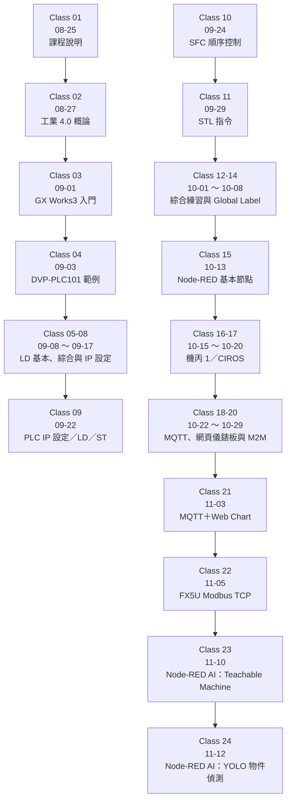
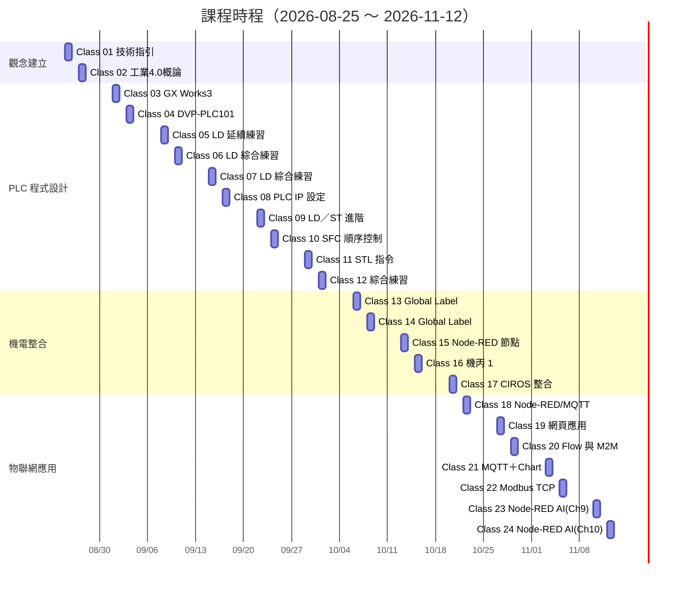
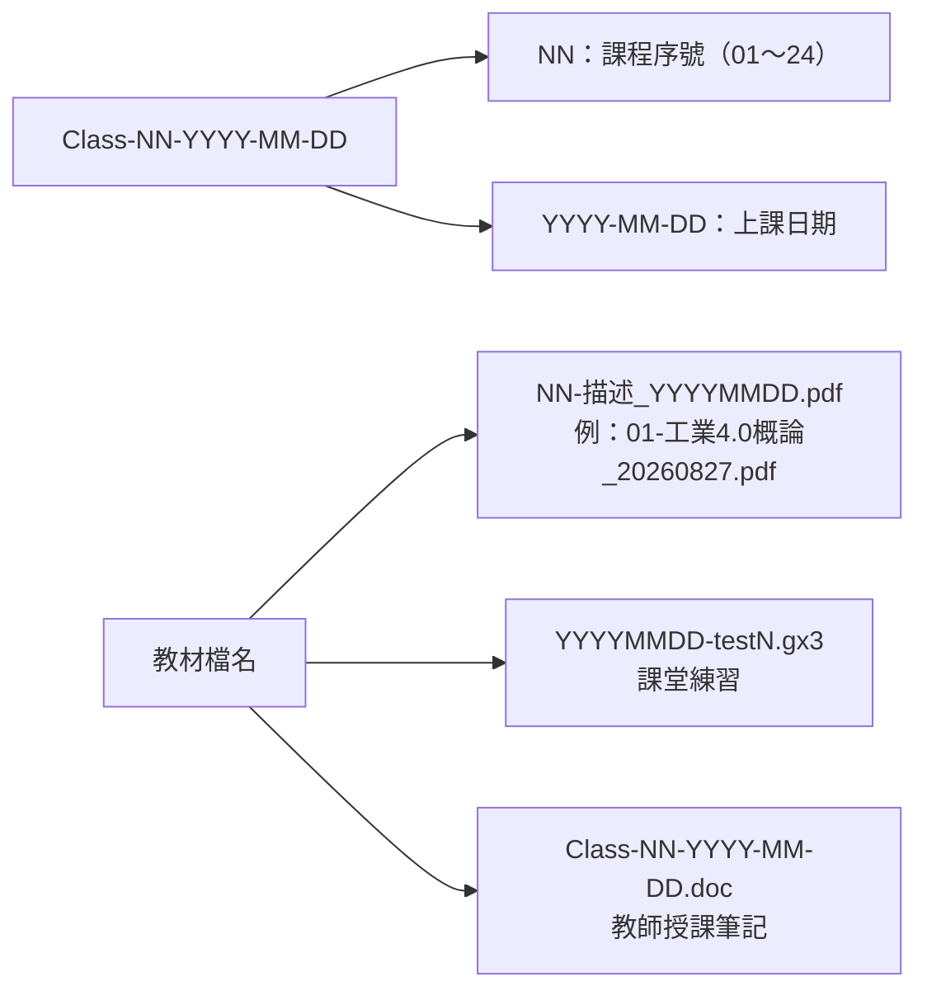

# 課程教材地圖（Course Map）

本文件逐一列出 24 堂課的資料夾、檔案數量、容量與主要教材，作為快速查找與點名核對的依據。
統計時間：2026-11-12；僅計入工作目錄實體檔案（含被 `.gitignore` 排除的大型壓縮檔）。

---

## 1. 學習路徑

```mermaid
flowchart TD
    A["Class 01<br/>08-25<br/>課程說明"] --> B["Class 02<br/>08-27<br/>工業 4.0 概論"]
    B --> C["Class 03<br/>09-01<br/>GX Works3 入門"]
    C --> D["Class 04<br/>09-03<br/>DVP-PLC101 範例"]
    D --> E["Class 05-08<br/>09-08 ～ 09-17<br/>LD 基本、綜合與 IP 設定"]
    E --> F["Class 09<br/>09-22<br/>PLC IP 設定／LD／ST"]
    G["Class 10<br/>09-24<br/>SFC 順序控制"] --> H["Class 11<br/>09-29<br/>STL 指令"]
    H --> I["Class 12-14<br/>10-01 ～ 10-08<br/>綜合練習與 Global Label"]
    I --> J["Class 15<br/>10-13<br/>Node-RED 基本節點"]
    J --> K["Class 16-17<br/>10-15 ～ 10-20<br/>機丙 1／CIROS"]
    K --> L["Class 18-20<br/>10-22 ～ 10-29<br/>MQTT、網頁儀錶板與 M2M"]
    L --> M["Class 21<br/>11-03<br/>MQTT＋Web Chart"]
    M --> N["Class 22<br/>11-05<br/>FX5U Modbus TCP"]
    N --> O["Class 23<br/>11-10<br/>Node-RED AI：Teachable Machine"]
    O --> P["Class 24<br/>11-12<br/>Node-RED AI：YOLO 物件偵測"]
```

---

## 2. 逐堂教材清單

| # | 資料夾 | 日期 | 檔案數 | 容量 | 主要教材 |
|:--:|---|---|--:|--:|---|
| 01 | `Class-01-2026-08-25` | 2026-08-25 | 4 | 3.0 MB | 工業 4.0 技術指引、Basic 講義、115-2 課表 |
| 02 | `Class-02-2026-08-27` | 2026-08-27 | 6 | 84.8 MB | 工業 4.0 概論、Node-RED Server／Setup 壓縮檔、共用 PDF 壓縮檔 |
| 03 | `Class-03-2026-09-01` | 2026-09-01 | 17 | 1,800.6 MB | GX Works3 手冊、GX Works3 更新包（1.69 GB，未納版控）、`20260901-test1.gx3` |
| 04 | `Class-04-2026-09-03` | 2026-09-03 | 7 | 1,714.2 MB | DVP-PLC101 範例、`EX101-LD-20260903.gx3`、更新包（未納版控） |
| 05 | `Class-05-2026-09-08` | 2026-09-08 | 22 | 119.3 MB | 基本指令講義、6 個課堂 `.gx3`、09-04／09-08 兩次授課筆記 |
| 06 | `Class-06-2026-09-10` | 2026-09-10 | 15 | 94.0 MB | `2026-09-10-1.gx3`、LD 綜合筆記 |
| 07 | `Class-07-2026-09-15` | 2026-09-15 | 15 | 94.0 MB | 同 Class-06 素材的另一份快照 |
| 08 | `Class-08-2026-09-17` | 2026-09-17 | 17 | 96.1 MB | `PLC-IP-SET.gx3`、IP145 範本、Class-07 筆記 |
| 09 | `Class-09-2026-09-22` | 2026-09-22 | 21 | 98.5 MB | 基本 LD／ST 講義、ST Advance 範例、Class-08 筆記 |
| 10 | `Class-10-2026-09-24` | 2026-09-24 | 15 | 19.8 MB | SFC 講義與選單章節、ST／FN 範例、6 張操作截圖 |
| 11 | `Class-11-2026-09-29` | 2026-09-29 | 4 | 7.8 MB | EX101 STL 範例、`2026-09-29.gx3`、Class-11 筆記 |
| 12 | `Class-12-2026-10-01` | 2026-10-01 | 7 | 15.6 MB | 兩個綜合練習 `.gx3`、Class-12 筆記、2 張截圖 |
| 13 | `Class-13-2026-10-06` | 2026-10-06 | 7 | 16.1 MB | `2026-10-06-01.gx3`、Global Label 說明圖 |
| 14 | `Class-14-2026-10-08` | 2026-10-08 | 4 | 11.6 MB | `2026-10-08-1.gx3`、Class-14 筆記 |
| 15 | `Class-15-2026-10-13` | 2026-10-13 | 30 | 21.9 MB | Node-RED 基本節點／儀錶板 PDF、Day2 教材、switch + change 練習素材 |
| 16 | `Class-16-2026-10-15` | 2026-10-15 | 33 | 23.7 MB | 機丙 1 教學範例、IP 練習、Node-RED 教材 |
| 17 | `Class-17-2026-10-20` | 2026-10-20 | 36 | 25.6 MB | CIROS 機電整合丙 1 整合、IP133 範例、教師版 tutorial |
| 18 | `Class-18-2026-10-22` | 2026-10-22 | 79 | 173.6 MB | Node-RED 網頁應用 4 個範例、MQTT 工具（Mosquitto／Explorer／MQTTBox） |
| 19 | `Class-19-2026-10-27` | 2026-10-27 | 57 | 162.8 MB | Node-RED 網頁控制 LED、定時開關、Chart、Ngrok 轉址、MQTT 工具 |
| 20 | `Class-20-2026-10-29` | 2026-10-29 | 73 | 39.0 MB | Node-RED Flow 1／2 匯出頁面、M2M 講義、PLC 範本 `2026-10-29-template-1.gx3` |
| 21 | `Class-21-2026-11-03` | 2026-11-03 | 76 | 548.1 MB | Node-RED MQTT 應用 PDF、`06~08` 流程（Web Chart／清空資料／雙 Y 軸）、`Day5_20261103.zip` |
| 22 | `Class-22-2026-11-05` | 2026-11-05 | 81 | 548.7 MB | FX5U Modbus TCP 讀／寫流程 JSON、`20261105-2.gx3`、M2M 講義、`Day5_20261103.zip` |
| 23 | `Class-23-2026-11-10` | 2026-11-10 | 28 | 38.1 MB | Teachable Machine 訓練、Ch9 講義 PDF、`ch09-examples/` 7 個範例流程、Webcam 判斷 LED 流程 |
| 24 | `Class-24-2026-11-12` | 2026-11-12 | 14,506 | 581.3 MB | Ch10 講義 PDF、`ch10-examples/`（YOLO 標註、訓練、推論腳本）、Thonny 攜帶版 IDE、labelImg 工具 |
| — | `80-自動控制工程職類共用資料-PDF` | — | 11 | 85.9 MB | Delta／FX5U／CIROS 共用手冊與規範 |
| — | `netcheck` | — | 24 | 0.2 MB | 網路 Port、測速、網站連線診斷腳本與報告 |

> 容量以資料夾實體檔案計算，包含未納入 Git 的 1.69 GB 更新包，因此 Class-03／04 的數字遠高於其他堂課。
> Class-24 的容量含 Thonny 攜帶版 IDE（13,325 個檔案）與 labelImg 工具原始碼；
> `Day7_20261112.zip`（147 MB）超過 GitHub 單檔上限，已排除於版控之外，內容由 `Day7_20261112/` 目錄完整保留。

```mermaid
gantt
    title 課程時程（2026-08-25 ～ 2026-11-12）
    dateFormat YYYY-MM-DD
    axisFormat %m/%d
    section 觀念建立
    Class 01 技術指引        :c01, 2026-08-25, 1d
    Class 02 工業4.0概論      :c02, 2026-08-27, 1d
    section PLC 程式設計
    Class 03 GX Works3       :c03, 2026-09-01, 1d
    Class 04 DVP-PLC101      :c04, 2026-09-03, 1d
    Class 05 LD 延續練習      :c05, 2026-09-08, 1d
    Class 06 LD 綜合練習      :c06, 2026-09-10, 1d
    Class 07 LD 綜合練習      :c07, 2026-09-15, 1d
    Class 08 PLC IP 設定      :c08, 2026-09-17, 1d
    Class 09 LD／ST 進階      :c09, 2026-09-22, 1d
    Class 10 SFC 順序控制     :c10, 2026-09-24, 1d
    Class 11 STL 指令         :c11, 2026-09-29, 1d
    Class 12 綜合練習         :c12, 2026-10-01, 1d
    section 機電整合
    Class 13 Global Label    :c13, 2026-10-06, 1d
    Class 14 Global Label    :c14, 2026-10-08, 1d
    Class 15 Node-RED 節點    :c15, 2026-10-13, 1d
    Class 16 機丙 1           :c16, 2026-10-15, 1d
    Class 17 CIROS 整合       :c17, 2026-10-20, 1d
    section 物聯網應用
    Class 18 Node-RED/MQTT   :c18, 2026-10-22, 1d
    Class 19 網頁應用         :c19, 2026-10-27, 1d
    Class 20 Flow 與 M2M      :c20, 2026-10-29, 1d
    Class 21 MQTT＋Chart     :c21, 2026-11-03, 1d
    Class 22 Modbus TCP      :c22, 2026-11-05, 1d
    Class 23 Node-RED AI(Ch9) :c23, 2026-11-10, 1d
    Class 24 Node-RED AI(Ch10):c24, 2026-11-12, 1d
```

> 註：Class-05 同時收錄 2026-09-04 與 2026-09-08 兩次授課筆記；Class-06 與 Class-07 為 LD 綜合練習的兩份素材快照。

---

## 3. 技能矩陣

| 能力項目 | 對應課程 | 教材證據 |
|---|---|---|
| 工業 4.0 概念與職能範圍 | 01、02 | 技術指引、概論講義、課表 |
| GX Works3 操作與專案管理 | 03～09 | 操作手冊、`.gx3` 專案 |
| 階梯圖（LD）設計 | 04～09 | `EX101-LD`、多個練習 `.gx3` |
| PLC 網路與 IP 設定 | 08、16、17 | `PLC-IP-SET.gx3`、`2026-09-15-IP145-template.gx3` |
| 結構化文本（ST） | 09、10、11 | `basic ST`、`ST Advance`、`STL` |
| 順序控制（SFC） | 10 | SFC 講義與選單章節 |
| 標籤化程式設計 | 13、14 | Global Label 教材與範例 |
| 機電整合丙級實作 | 16、17 | 機丙 1 tutorial、CIROS IO 表與規範 |
| Node-RED 流程設計 | 15、18～24 | 基本節點、儀錶板、Chart、LED 控制、Flow 匯出 |
| MQTT／M2M 通訊 | 18、19、20、21、22 | Mosquitto 安裝檔、MQTT Explorer、M2M 講義、Web Chart 進階 |
| Modbus TCP PLC 通訊 | 22 | `fx5u_modbus_read.json`／`fx5u_modbus_write.json`、`20261105-2.gx3` |
| AI 影像分類（Teachable Machine） | 23 | Ch9 講義、`ch09-examples/` 範例流程、Webcam 判斷 LED 流程 |
| AI 物件偵測（YOLO） | 24 | Ch10 講義、labelImg 標註、`001`～`003` 訓練推論腳本、`ch10-examples/` |
| Python 影像處理與模型訓練 | 24 | `step2_frame_splitter.py`、`Step3`～`Step5`、`002_train_starwars.py` |
| 網路診斷 | netcheck | Port 測試、測速、網站連線報告 |

---

## 4. 檔案命名規則

```mermaid
flowchart LR
    A["Class-NN-YYYY-MM-DD"] --> B["NN：課程序號（01～24）"]
    A --> C["YYYY-MM-DD：上課日期"]
    D["教材檔名"] --> E["NN-描述_YYYYMMDD.pdf<br/>例：01-工業4.0概論_20260827.pdf"]
    D --> F["YYYYMMDD-testN.gx3<br/>課堂練習"]
    D --> G["Class-NN-YYYY-MM-DD.doc<br/>教師授課筆記"]
```

| 模式 | 意義 | 範例 |
|---|---|---|
| `Class-NN-YYYY-MM-DD/` | 單堂課資料夾 | `Class-22-2026-11-05/` |
| `NN-描述_YYYYMMDD.pdf` | 依課堂順序編號的講義 | `01-工業4.0概論_20260827.pdf` |
| `YYYYMMDD-testN.gx3` | 當日第 N 個練習 | `20260908-test3.gx3` |
| `Class-NN-YYYY-MM-DD.doc` | 教師授課筆記 | `Class-22-2026-11-05.doc` |
| `*teacher*.gx3` | 教師示範版 | `0929-teacher-EX101 STL.gx3` |

> **課次編號對應**：課次編號已與 YouTube 頻道存檔標題一致（Class01＝2026-08-25 … Class24＝2026-11-12）。
> 授課筆記的檔名沿用原始命名（例如 `Class-05-2026-09-04-notes.doc` 為 09-04 該次授課的筆記），
> 與所在資料夾的編號不一定相同，請以檔案內容的日期為準。

---

## 5. 重複與待整理項目

| 項目 | 狀況 | 建議 |
|---|---|---|
| `Class-06`／`Class-07` | LD 綜合練習的兩份素材快照，內容幾乎相同 | 保留現狀（歷史紀錄），於本文件註明 |
| `Class-05` | 同時含 09-04 與 09-08 兩次授課筆記 | 保留現狀，檔名已標明日期 |
| `DVP-PLC101samples_tc.pdf` | 出現於 Class-04～09、12、13 | 可改為連結共用 `80-.../Delta` 版本，縮減容量 |
| `80-自動控制工程職類共用資料-PDF` | Class-03、05、06、07、08、09 各有一份完整複本 | 同上，長期可考慮以符號連結或文件索引取代 |
| `MQTT 工具` | Class-18／19／21／22 各一份，含 93 MB 安裝檔重複副本 | 若需長期保存，改用 Git LFS 或 GitHub Releases |
| `90-sw1dnd-gxw3-e_117x(update).zip` | 1.69 GB × 2，已被 `.gitignore` 排除 | 維持排除，避免超過 GitHub 單檔 100 MB 限制 |
| `Day5_20261103.zip` | Class-21／22 各一份（約 96 MB，接近單檔上限） | 維持現狀；若需更新改用 Git LFS／Releases |
| `Day7_20261112.zip` | Class-24 一份（**147 MB，超過 GitHub 100 MB 硬性上限**） | **已排除於版控**；內容完整保留於 `Day7_20261112/` 目錄與 `ch10-examples/` |
| `thonny-5.0.1-windows-portable-x64/` | 攜帶版 Python IDE，13,325 個檔案 | 依專案需求保留；若要縮減可改用 `.zip` 單檔交付 |
| `labelImg/` | 第三方標註工具原始碼 | 保留（Ch10 實作需要）；其自身 `.gitignore` 已排除 `__pycache__`／`*.pyc` |

---

*本文件由教材目錄自動盤點後人工整理；若新增課程，請同步更新本表與 [README.md](../README.md) 的課程索引。*
